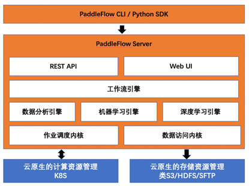
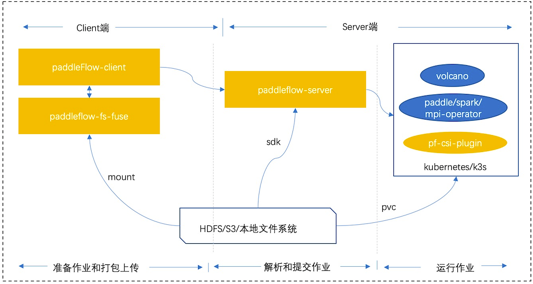

**PaddleFlow**简称PF，AI资源管理与调度工具。基于云原生Kubernetes或K3s，提供面向AI开发的批量作业执行系统，并且提供易用的共享文件系统，在apache license2.0 开源协议下发布。
PaddleFlow作为机器学习平台的资源核心，适用于机器学习和深度学习的单机和分布式作业，针对作业依赖的算力和存储资源进行多租户管理和调度；提供缓存编排和加速的能力，降低访问远程存储的频率，提升训练效率；提供工作流用于编排AI作业，模板化AI作业的训练流程，提升实验效率。
总的来说，PaddleFlow为用户屏蔽各种各样的资源对接和管理细节，让用户编排和执行AI作业更简单，更高效，上手成本更低。
# 核心特性
## 1.存储
- 兼容posix协议，提供高性能fuse文件系统（PaddleFlowFS），内置两层缓存能力，提供API、Fuse、CSI三种使用方式
- 同时，结合缓存亲和性调度策略提供缓存位置感知能力，将数据本地化，极大提升训练效率
## 2.调度
- 基于kubernetes的计算资源池化管理
- 基于华为开源的volcano的队列调度
- 内置主流深度学习计算框架引擎（Paddle、Tensorflow等）
- 支持机器学习和数据分析框架（Spark等）
## 3.工作流
- 通过工作流抽象复杂的命令，将其模板化，可被多次运行（支持断点运行和产出Artifact管理）和分享。
- 提供python客户端，同时支持通过静态Yaml的方式进行作业编排
- 支持运行在主流的DAG执行引擎上（未来版本），如Argo、Airflow等
# 架构
PaddleFlow由四个部分组成：
- 1.PaddleFlow 客户端（包含PaddleFlowFS）: 命令行工具方便用户在开发机安装和使用，PaddleFlow 客户端（包含PaddleFlowFS）: 命令行工具方便用户在开发机安装和使用，其中PaddleFlowFS基于fuse实现，兼容posix语义，支持AI作业常用的命令，内置缓存能力，加速远端数据读写，同时支持多种数据源的对接，比如BOS等类S3系统，HDFS，本地文件系统等。
- 2.PaddleFlow server: PaddleFlow核心服务，主要包含队列、存储、工作流等核心功能的管理。
- 3.volcano（基于开源volcano改造）: 主要增加elastic quota更灵活管理资源的能力，未来会逐步提交社区review。
- 4.paddleflow-csi-plugin: 基于kubernetes csi插件机制实现了PaddleFlowFS接入并提供fuse客户端的管理能力。

 

PaddleFlow的部署主要分为客户端和服务端，其中客户端主要用于准备和打包作业，服务端主要用于作业解析和作业管理，其中执行作业如图中示例主要为kubernetes和k3s。其中，他们会共用一个共享的文件系统，这样会更加方便用户更加直观的查看作业状态和日志等。

# 快速部署
点击[PaddleFlow安装部署](docs/zh_cn/deployment/how_to_install_paddleflow.md)
里面包含PaddleFlow客户端和服务的部署方式
# 快速上手
## 命令行参考
点击[命令行操作说明](docs/zh_cn/reference/client_command_reference.md) 获取所有操作命令和示例。
## python sdk参考
点击[sdk使用说明](docs/zh_cn/reference/sdk_reference/sdk_reference.md) 获取sdk的使用说明。
## 其他详细参考
工作流功能使用详解[工作流](docs/zh_cn/reference/pipeline/overview.md)  
作业功能实用详解[作业](docs/zh_cn/reference/job_reference.md)  
存储功能实用详解[存储](docs/zh_cn/reference/filesystem/filesystem_overview.md)  
CSI下存储挂载点恢复[挂载点恢复](docs/zh_cn/reference/filesystem/csi_mountpoint_recovery.md)  
# 开源协议
使用 apache license 2.0开源，详见 LICENSE。
# PaddlePaddle相关能力使用
待补充。

