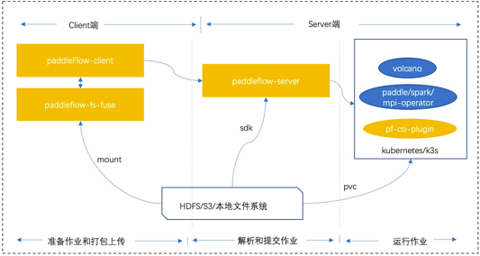

**PaddleFlow** is built based on Kubernetes or K3S, it's a batch job execution system designed for AI developers, and it provides shared file system which is very easy to use. It released under apache license v2.0. PaddleFlow can be as the resource core for machine learning platform, and very suitable for machine learning job and the single or distributed job of deep learning.
# Highlighted Features
## 1.Storage
- Posix protocol support
- Snapshot support (enterprise version）
- Read cache support
## 2.Scheduler
- Compute resource pools designed based on kubernetes
- Queue designed based on volcano which released by huawei
- Built-in Paddle,Spark,Tensorflow operator
## 3.Pipeline
- A dag scheduler(provides breakpoints operating mode and so on)
- Complex command abstraction, and custom templates can be executed multiple times
# Architecture
PaddleFlow consists of four parts:  
- **PaddleFlow client (built-in PaddleFlow fuse)**: PaddleFlow command line tool, it's convenient for users. Built-in PaddleFlow fuse lib is mainly used for cache data and snapshot, it can be accelerated the speed of reading and writing.Moreover,it supports multiple data sources,eg.bos,hdfs,local filesystem. 
- **PaddleFlow server**: The PaddleFlow core server, it mainly includes queue, storage and pipeline. 
- **Volcano(reform based on volcano from huawei)**: Add elastic quota feature,compute resource can manage more flexibly. We will commit the features to volcano community soon. 
- **PadddeFlow-csi-plugin**: Provides Kubernetes CSI driver to use PaddleFlow on Kubernetes. 

 

The deployment of PaddleFlow is mainly divided into client and server. paddleflow-client is mainly used for preparing and packaging jobs, and paddleflow-server mainly does job analysis(adjust to different runtimes) and management, last the runtime demo in the picture is kubernetes or k3s.
Both the client, server or runtime depends on a shared filesystem, it enables users to see the running status and log of jobs in time.

# Getting Started
You need to make preparations before using PaddleFlow:
- Prepare kubernetes environment 
- Download and install the PaddleFlow client 
Please refer to the quick start guide and start using PaddleFlow now
## Command reference
see [client command inference](docs/zh_cn/reference/client_command_reference.md) get all commands and examples.
## Python sdk reference
see [sdk inference](docs/zh_cn/reference/sdk_reference.md) get the sdk user manual.
## Other detailed reference
[Pipeline](docs/zh_cn/reference/pipeline/overview.md)  
[Job](docs/zh_cn/reference/job_reference.md)  
[Filesystem](docs/zh_cn/reference/filesystem/filesystem_overview.md)  
[fs_mountpoint_recovery](docs/zh_cn/reference/filesystem/csi_mountpoint_recovery.md)  
# Open source protocol
PaddleFlow is open-sourced under apache license v2.0, see [LICENSE](LICENSE).
# PaddlePaddle supports
To be added.
